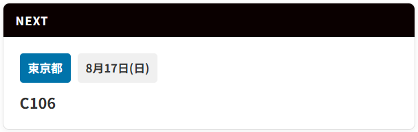
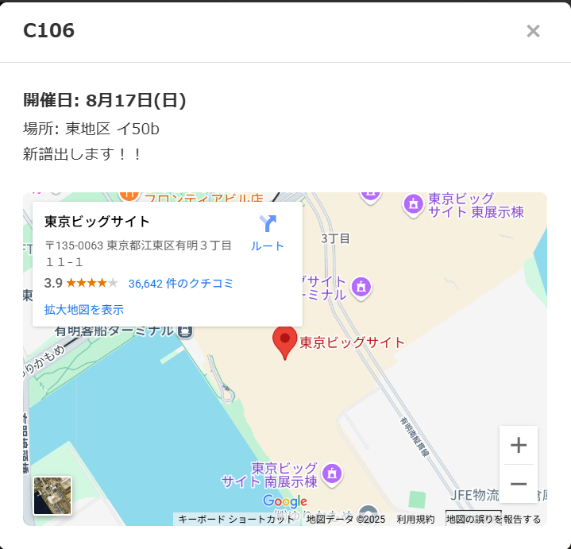
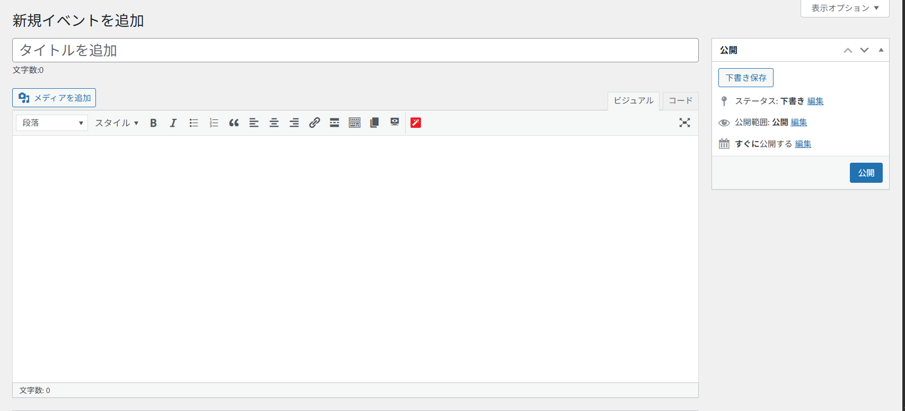
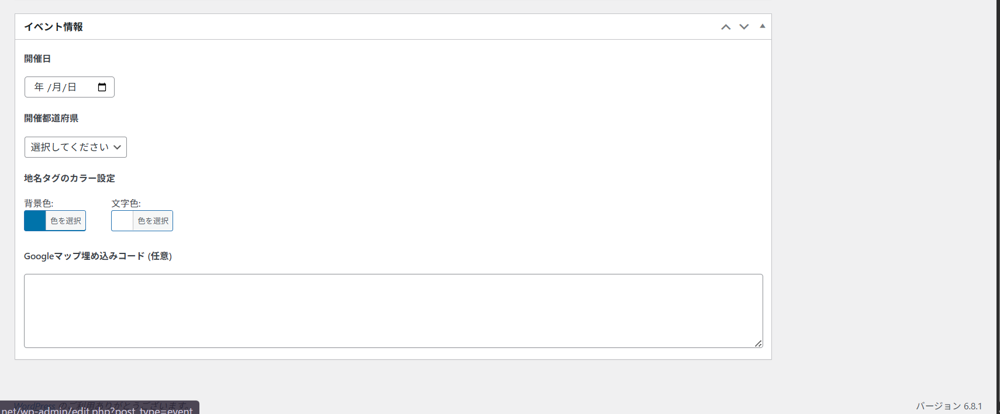
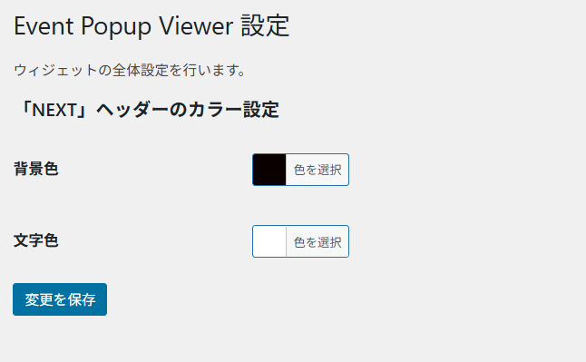

# Event Popup Viewer
- [Event Popup Viewer](#event-popup-viewer)
  - [概要](#概要)
  - [主な機能](#主な機能)
  - [インストール方法](#インストール方法)
      - [1. WordPress管理画面からインストール](#1-wordpress管理画面からインストール)
      - [2. 手動でインストール](#2-手動でインストール)
  - [使用方法](#使用方法)
    - [1. 初期設定（「NEXT」ヘッダーの色）](#1-初期設定nextヘッダーの色)
    - [2. イベントの登録](#2-イベントの登録)
    - [3. ウィジェットの表示](#3-ウィジェットの表示)
  - [スクリーンショット](#スクリーンショット)
  - [更新履歴](#更新履歴)
    - [1.0.0](#100)

**Event Popup Viewer** は、WordPressサイトに近日開催のイベントを一つだけ表示するウィジェットを追加するためのプラグインです。ショートコードを設置するだけで、登録したイベントが自動的に表示され、クリックすると詳細情報がポップアップで表示されます。

## 概要

このプラグインは、「次のイベント」をサイト訪問者に分かりやすく告知することを目的としています。管理画面からイベント名、開催日、開催地、概要などを簡単に登録できます。表示されるイベントは、開催日が過ぎると自動的に次の予定のイベントに切り替わります。

デザインのカスタマイズ性も備えており、管理画面からウィジェットのヘッダー色や、各イベントのタグの色を自由に変更できます。

## 主な機能

* **直近イベントの自動表示:** ショートコード `[event_list]` を使って、開催日が最も近い未来のイベントを1件だけ表示します。
* **詳細ポップアップ:** イベントをクリックすると、概要とGoogleマップが埋め込まれたポップアップが表示されます。
* **簡単なイベント管理:** WordPressの管理画面に専用の「イベント」メニューが追加され、直感的にイベントの登録・編集・削除ができます。
* **パーマリンクなし:** イベントは個別のページを持たず、データとしてのみ存在するため、サイト構造をシンプルに保てます。
* **開催地設定:** 47都道府県のドロップダウン選択に加え、「その他」を選んで自由な地名を入力できます。
* **カラーカスタマイズ機能:**
    * ウィジェットの「NEXT」ヘッダーの色（背景・文字）をプラグイン設定画面から変更可能。
    * イベントごとに「地名」タグの色（背景・文字）を個別に設定可能。
* **Google Maps APIキー不要:** Googleマップの「埋め込みコード」を貼り付けるだけで地図を表示できます。

## インストール方法

#### 1. WordPress管理画面からインストール
1.  [こちら](https://github.com/kudaken0/Event-Popup-Viewer/releases)から最新版のzipファイル(Event-Popup-Viewer_v○.○.○)をダウンロードします。
2.  WordPressの管理画面にログインし、「プラグイン」>「新規追加」に移動します。
3.  画面上部の「プラグインのアップロード」ボタンをクリックします。
4.  ダウンロードしたzipファイルを選択し、「今すぐインストール」をクリックします。
5.  インストールが完了したら、「プラグインを有効化」をクリックします。

#### 2. 手動でインストール
1.  このリポジトリからzipファイルをダウンロードし、解凍します。
2.  解凍してできた `event-popup-viewer` フォルダを、FTPクライアントなどを使ってサーバーの `/wp-content/plugins/` ディレクトリにアップロードします。
3.  WordPressの管理画面にログインし、「プラグイン」>「インストール済みプラグイン」に移動します。
4.  「Event Popup Viewer」を見つけて、「有効化」をクリックします。

## 使用方法

### 1. 初期設定（「NEXT」ヘッダーの色）
1.  WordPress管理画面の「設定」>「Event Popup Viewer」に移動します。
2.  「「NEXT」ヘッダーのカラー設定」で、背景色と文字色をカラーピッカーで選択します。
3.  「変更を保存」をクリックします。この色はすべてのイベントウィジェットで共通です。

### 2. イベントの登録
1.  管理画面の左側メニューに追加された「イベント」をクリックします。
2.  「新規イベントを追加」をクリックします。
3.  **タイトル**に「イベント名」を、本文の**エディタ**に「イベントの概要」を入力します。
4.  エディタの下にある「**イベント情報**」セクションで、以下の項目を設定します。
    * **開催日:** イベントの開催日を選択します。
    * **開催都道府県:** ドロップダウンから都道府県を選択します。リストにない地名を使いたい場合は、「その他」を選択すると入力欄が表示されるので、そこに入力します。
    * **地名タグのカラー設定:** このイベントの地名タグの背景色と文字色をカラーピッカーで設定します。
    * **Googleマップ埋め込みコード:** ポップアップに地図を表示したい場合、Googleマップで場所を検索し、「共有」→「地図を埋め込む」でコピーしたHTMLコードを貼り付けます。地図が不要な場合は空欄のままで構いません。
5.  すべての入力が終わったら、「公開」ボタンをクリックします。

### 3. ウィジェットの表示
1.  イベントウィジェットを表示したい投稿や固定ページの編集画面を開きます。
2.  本文中の好きな場所に、以下のショートコードを記述します。
    ```
    [event_list]
    ```
3.  ページを保存・公開すると、その場所に直近のイベントウィジェットが表示されます。

## スクリーンショット

-  **ウィジェット表示例**
  
    

-   **ポップアップ表示例**
   
    

-  **イベント編集画面**
  
    
    

-  **プラグイン設定画面**
  
    


## 更新履歴

### 1.0.0
* ver.1.1.0を公開

---"# Event-Popup-Viewer" 
